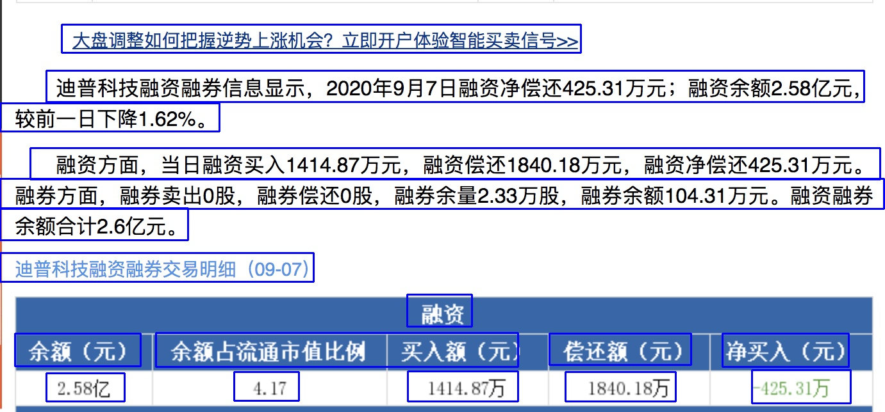

# pytorch-ocr

## 为什么做 pytorch-ocr

1. 车服业务的线下场景很多，有大量 OCR 场景的需求，如：保单、票据、车牌、VIN...等
2. 调研腾讯、阿里等 OCR 云服务，准确率无法满足特定场景
3. 目前中文 OCR 开源效果最好的项目是 darknet-ocr(原 chinese-ocr)，但作者为提供训练代码，同时环境配置非常复杂

## 参考项目：

1. darknet-ocr([github](https://github.com/chineseocr/darknet-ocr))，**pytorch-ocr 最主要的参考项目，模型结构和预训练权重均来自于此项目**。它是 github 上效果比较好的中文 OCR 项目，模型设计比较浅，性能和准确率都不错，但未提供训练代码，同时环境部署比较复杂。
2. pytorch_ctpn ([github](https://github.com/opconty/pytorch_ctpn))，CTPN 网络的 Pytorch 版本，参考 ctpn 网络的 loss 函数设计
3. PyTorch-YOLOv3([github](https://github.com/eriklindernoren/PyTorch-YOLOv3))，YOLO 的 Pytorch 版本，此项目提供 darknet 转 pytorch 的思路和基础代码实现

## 模型思路

1. 通过 ctpn 网络进行文本框检测 [[论文 arXiv:1609.03605](https://arxiv.org/abs/1609.03605)]，为提升 FPS，去除了 rnn/lstm 层
1. 通过 crnn 网络进行 ocr 检测，为提升 FPS，去除了 rnn/lstm 层

## pytorch-ocr 如何使用

1. clone 项目

```
git clone git-url
```

2. 下载模型文件（中文）

```
pytorch-ocr-weights.zip解压缩后拷贝到weights下，直接覆盖文件夹
```

3. OCR 测试(文本定位+OCR 检测)，代码调用可参考参考: [ipynb](pytorch-darknet-ocr-train/pytorch-ocr-demo.ipynb)

```
python3 predict_demo.py test/demo_text_ocr.png
```



```
[{
		"text": "大盘调整如何把握逆势上涨机会?立即开户体验智买卖信号>>",
		"prob": 1.0,
		"box": [96,38,906,38,906,81,96,82],
		"textprob": 0.99
	},
	{
		"text": "迪普科技融资融券信息显示,2020年9月7日融资净偿还425.31万元;融资余额2.58亿元,",
		"prob": 1.0,
		"box": [72,113,1348,110,1348,158,72,159
		],
		"textprob": 0.99
	},...
]
```

4. OCR 检测(不定位文本)，代码调用可参考参考: [ipynb]

```
python3 predict_ocr_only.py test/dd.jpg
```


5. 竖版文字检测（训练代码支持竖版文字检测，预训练模型不支持）


## 训练自己的数据

1. train crnn 网络（ocr 检测）
   - 数据标注准备，将 train_val.txt,test_val.txt，保持到 crnn_dataset 目录
     

- 将训练数据打包成 lmdb 格式（代码中提供样例 lmdb 可直接测试训练）

```
cd crnn_dataset
python3 create_dataset.py train_val.txt test_val.txt
cd ..
```

- 开始训练(可以根据实际需要修改参数)

```
python3 train_crnn.py
```

2. train ctpn 网络（text 定位检测）
   - 数据标注准备，用 ImageLabel 工具打标，使用 VOC 格式的数据（代码提供样例数据），将数据保存到 ctpn_dataset 目录
   - 开始训练(可以根据实际需要修改参数)

```
python3 train_ctpn.py
```
